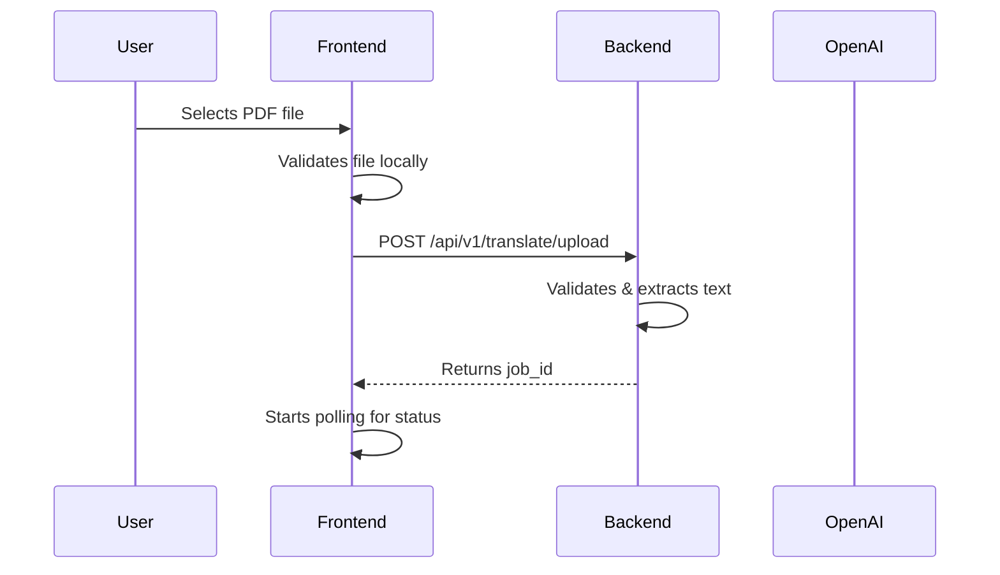
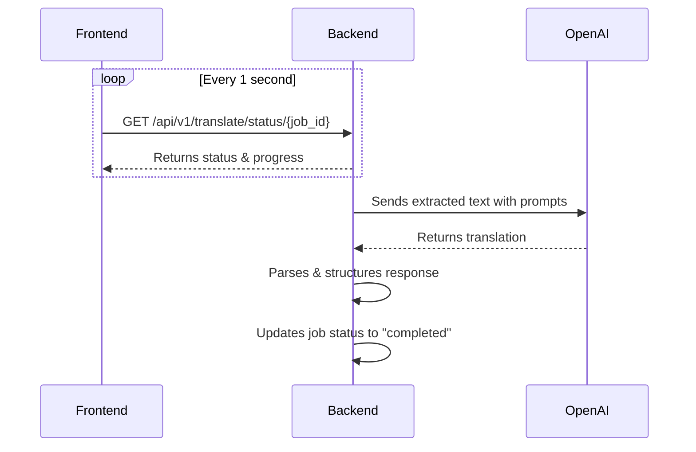
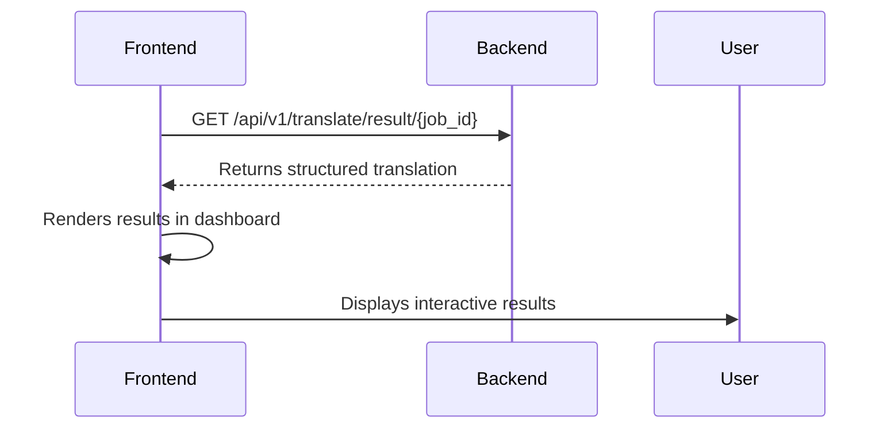

# 🏥 Medical Record Translator

A modern web application that transforms complex medical documents into plain English using AI, helping patients better understand their health records.


## 📋 Table of Contents

- [About This App](#about-this-app)
- [Key Features](#key-features)
- [Architecture Overview](#architecture-overview)
- [Frontend Components](#frontend-components)
- [Backend Components](#backend-components)
- [How Frontend and Backend Interact](#how-frontend-and-backend-interact)
- [Getting Started](#getting-started)
- [Running the Application](#running-the-application)
- [API Documentation](#api-documentation)
- [Deployment](#deployment)
- [Security & Privacy](#security--privacy)
- [Contributing](#contributing)

## 🎯 About This App

The Medical Record Translator is designed to bridge the gap between medical professionals and patients by translating complex medical terminology into easy-to-understand language. Whether you receive lab results or prescriptions, this app helps you understand what they mean for your health.

### Problem It Solves

- **Medical Jargon**: Patients often receive documents filled with technical terms they don't understand
- **Health Literacy**: Many people struggle to interpret their test results or medication instructions
- **Doctor-Patient Communication**: Limited appointment time makes it hard to explain everything in detail
- **Accessibility**: Not everyone has immediate access to healthcare professionals for clarification

### Our Solution

Using advanced AI (OpenAI GPT-4), we:
- Extract text from PDF medical documents
- Identify the type of document (lab results or prescription)
- Translate medical terms into plain English
- Provide context about what results mean
- Organize information in an easy-to-read format
- Display results in an interactive dashboard

## ✨ Key Features

- **📄 PDF Upload**: Drag-and-drop interface for easy file upload
- **🤖 AI-Powered Translation**: Uses GPT-4 for accurate medical translations
- **📊 Interactive Dashboard**: Visual representation of lab results with color-coded indicators
- **🔒 Privacy-First**: No data storage - files are deleted after processing
- **📱 Responsive Design**: Works seamlessly on desktop, tablet, and mobile
- **⚡ Real-time Progress**: Live updates during document processing
- **🎨 Intuitive UI**: Clean, modern interface that's easy to navigate

## 🏗️ Architecture Overview

```
┌─────────────────┐         ┌─────────────────┐         ┌─────────────────┐
│                 │         │                 │         │                 │
│   React SPA     │ <-----> │  FastAPI Backend│ <-----> │  OpenAI API     │
│   (Frontend)    │  HTTP   │   (Python)      │  HTTPS  │   (GPT-4)       │
│                 │         │                 │         │                 │
└─────────────────┘         └─────────────────┘         └─────────────────┘
        │                           │
        │                           │
        ▼                           ▼
┌─────────────────┐         ┌─────────────────┐
│                 │         │                 │
│   Browser       │         │   Redis Cache   │
│   Storage       │         │   (Optional)    │
│                 │         │                 │
└─────────────────┘         └─────────────────┘
```

## 🎨 Frontend Components

The frontend is built with React 18 and Vite, providing a fast and modern user experience.

### Component Structure

```
frontend/src/
├── components/
│   ├── FileUpload.jsx       # Drag-and-drop file upload interface
│   ├── LoadingSpinner.jsx   # Progress indicator during processing
│   ├── TestProgress.jsx     # Real-time progress updates
│   ├── TestResultsTable.jsx # Interactive dashboard for lab results
│   └── TranslationResults.jsx # Main results display component
├── services/
│   └── api.js              # API client for backend communication
├── App.jsx                 # Main application component
├── main.jsx               # Application entry point
└── index.css              # Global styles with Tailwind CSS
```

### Key Components Explained

#### 1. **FileUpload.jsx**
- Handles PDF file selection and validation
- Supports drag-and-drop and click-to-upload
- Validates file type (PDF only) and size (max 10MB)
- Shows file preview with option to remove

#### 2. **LoadingSpinner.jsx**
- Displays during file processing
- Shows percentage progress
- Animated spinner for visual feedback
- Updates status messages in real-time

#### 3. **TestResultsTable.jsx**
- Creates the interactive medical dashboard
- Groups tests by category (Blood Count, Metabolic, etc.)
- Color-codes results (green=normal, red=abnormal, yellow=borderline)
- Displays detailed explanations for each test
- Animated card appearance for better UX

#### 4. **TranslationResults.jsx**
- Main container for displaying results
- Handles both lab results and prescriptions
- Provides download functionality
- Includes medical disclaimer

#### 5. **App.jsx**
- Manages application state
- Handles file upload flow
- Coordinates API calls
- Routes between upload and results views

### Frontend Technologies

- **React 18**: Modern UI library with hooks
- **Vite**: Lightning-fast build tool
- **Tailwind CSS**: Utility-first styling
- **Axios**: HTTP client for API calls
- **React Dropzone**: File upload handling
- **React Toastify**: User notifications
- **React Markdown**: Formatted text rendering
- **React Icons**: Consistent iconography

## ⚙️ Backend Components

The backend is built with Python FastAPI, providing a robust and scalable API.

### Component Structure

```
backend/app/
├── routers/
│   └── translate.py        # API endpoints for translation
├── services/
│   ├── ai_translator.py    # OpenAI integration & translation logic
│   ├── pdf_processor.py    # PDF text extraction
│   └── validators.py       # File validation & security
├── prompts/
│   ├── lab_results.py      # Prompts for lab result translation
│   └── prescriptions.py    # Prompts for prescription translation
├── config.py              # Application configuration
└── main.py               # FastAPI application setup
```

### Key Components Explained

#### 1. **main.py**
- FastAPI application initialization
- CORS middleware configuration
- Global exception handling
- Health check endpoint

#### 2. **translate.py (Router)**
Provides three main endpoints:
- `POST /upload`: Accepts PDF files and starts processing
- `GET /status/{job_id}`: Returns processing status and progress
- `GET /result/{job_id}`: Returns translation results

#### 3. **ai_translator.py**
Core translation service that:
- Manages OpenAI API communication
- Formats prompts based on document type
- Parses AI responses into structured data
- Extracts test data from markdown format
- Handles error cases and retries

#### 4. **pdf_processor.py**
- Extracts text from PDF files using PyMuPDF
- Cleans and normalizes extracted text
- Identifies document type (lab results vs prescription)
- Handles various PDF formats

#### 5. **validators.py**
- Validates file type and size
- Checks for malicious content
- Ensures PDF readability
- Implements security measures

### Backend Technologies

- **FastAPI**: High-performance async web framework
- **PyMuPDF (fitz)**: PDF text extraction
- **OpenAI Python SDK**: GPT-4 integration
- **Pydantic**: Data validation and serialization
- **Python-Multipart**: File upload handling
- **Uvicorn**: ASGI server
- **Redis** (optional): Job status caching

## 🔄 How Frontend and Backend Interact

The frontend and backend communicate through a RESTful API with the following flow:

### 1. File Upload Flow



### 2. Processing Flow



### 3. Results Flow



### Key Integration Points

1. **API Proxy Configuration**
   - Development: Vite proxies `/api` requests to `localhost:8000`
   - Production: Both services on same domain or CORS configured

2. **Status Updates**
   - Backend tracks progress through stages:
     - `extracting_text` (20%)
     - `identifying_document_type` (40%)
     - `translating` (60-90%)
     - `completed` (100%)

3. **Error Handling**
   - Frontend displays user-friendly error messages
   - Backend returns structured error responses
   - Automatic retry logic for transient failures

4. **Data Format**
   - Frontend sends: `multipart/form-data` with PDF file
   - Backend returns: JSON with structured translation data
   - Special handling for lab results with test data array

## 🚀 Getting Started

### Prerequisites

- **Node.js 18+** and npm (for frontend)
- **Python 3.11+** (for backend)
- **OpenAI API key** with GPT-4 access
- **Git** for version control

### Installation

1. **Clone the repository**
   ```bash
   git clone https://github.com/yourusername/medical-record-translator.git
   cd medical-record-translator
   ```

2. **Set up the backend**
   ```bash
   cd backend
   
   # Create virtual environment
   python -m venv venv
   
   # Activate virtual environment
   # On Windows:
   venv\Scripts\activate
   # On macOS/Linux:
   source venv/bin/activate
   
   # Install dependencies
   pip install -r requirements.txt
   
   # Create .env file
   cp .env.example .env
   
   # Edit .env and add your OpenAI API key
   # OPENAI_API_KEY=sk-...your-key-here
   ```

3. **Set up the frontend**
   ```bash
   cd ../frontend
   
   # Install dependencies
   npm install
   ```

## 💻 Running the Application

You need to run both the backend and frontend servers simultaneously.

### Start the Backend Server

1. **Open a terminal** and navigate to the backend directory:
   ```bash
   cd backend
   ```

2. **Activate the virtual environment**:
   ```bash
   # On Windows:
   venv\Scripts\activate
   
   # On macOS/Linux:
   source venv/bin/activate
   ```

3. **Start the FastAPI server**:
   ```bash
   uvicorn app.main:app --reload --port 8000
   ```
   
   The backend will be available at `http://localhost:8000`
   
   You can view the API documentation at `http://localhost:8000/docs`

### Start the Frontend Server

1. **Open a new terminal** (keep the backend running) and navigate to the frontend directory:
   ```bash
   cd frontend
   ```

2. **Start the development server**:
   ```bash
   npm run dev
   ```
   
   The frontend will be available at `http://localhost:5173`

### Verify Everything is Working

1. Open your browser and go to `http://localhost:5173`
2. You should see the Medical Record Translator interface
3. Try uploading a sample PDF file
4. Check both terminal windows for any error messages

### Common Commands

#### Backend Commands
```bash
# Run backend in development mode
uvicorn app.main:app --reload --port 8000

# Run backend in production mode
uvicorn app.main:app --host 0.0.0.0 --port 8000 --workers 4

# Run tests
pytest

# Format code
black app/

# Lint code
flake8 app/
```

#### Frontend Commands
```bash
# Start development server
npm run dev

# Build for production
npm run build

# Preview production build
npm run preview

# Run linting
npm run lint

# Format code
npm run format
```

## 📚 API Documentation

### Endpoints

#### 1. Upload Document
```http
POST /api/v1/translate/upload
Content-Type: multipart/form-data

Body:
- file: PDF file (max 10MB)

Response:
{
  "job_id": "550e8400-e29b-41d4-a716-446655440000",
  "status": "processing",
  "message": "File uploaded successfully"
}
```

#### 2. Check Status
```http
GET /api/v1/translate/status/{job_id}

Response:
{
  "job_id": "550e8400-e29b-41d4-a716-446655440000",
  "status": "translating",
  "progress": 75,
  "message": "Translating document..."
}
```

#### 3. Get Results
```http
GET /api/v1/translate/result/{job_id}

Response:
{
  "job_id": "550e8400-e29b-41d4-a716-446655440000",
  "status": "completed",
  "result": {
    "document_type": "lab_results",
    "translation": "...",
    "sections": {...},
    "test_data": [...]
  }
}
```

#### 4. Health Check
```http
GET /api/v1/translate/health

Response:
{
  "status": "healthy",
  "version": "1.0.0"
}
```

## 🚀 Deployment

For detailed deployment instructions, see:
- [QUICK_DEPLOYMENT_GUIDE.md](QUICK_DEPLOYMENT_GUIDE.md) - Railway & Render deployment
- [DEPLOYMENT_CHECKLIST.md](DEPLOYMENT_CHECKLIST.md) - Pre-deployment checklist

Quick deployment options:
- **Railway.app**: One-click deploy with automatic scaling
- **Render.com**: Blueprint-based deployment with generous free tier
- **Vercel + Supabase**: Frontend on Vercel, backend on Supabase
- **Docker**: Containerized deployment for any platform

## 🔒 Security & Privacy

- **No Data Storage**: Files are processed in memory and immediately deleted
- **Encrypted Communication**: All API calls use HTTPS in production
- **Input Validation**: Strict file type and size limits
- **Rate Limiting**: Prevents abuse and controls costs
- **Environment Variables**: Sensitive data never committed to code
- **CORS Protection**: Only authorized origins can access the API

## 🤝 Contributing

We welcome contributions! Please see our contributing guidelines:

1. Fork the repository
2. Create a feature branch (`git checkout -b feature/amazing-feature`)
3. Commit your changes (`git commit -m 'Add amazing feature'`)
4. Push to the branch (`git push origin feature/amazing-feature`)
5. Open a Pull Request

### Development Setup

1. Follow the installation steps above
2. Install development dependencies:
   ```bash
   # Backend
   pip install -r requirements-dev.txt
   
   # Frontend
   npm install --save-dev
   ```

3. Run tests before submitting PR:
   ```bash
   # Backend tests
   pytest
   
   # Frontend tests
   npm test
   ```

## 📄 License

This project is licensed under the MIT License - see the LICENSE file for details.

## ⚠️ Disclaimer

This application is designed to help patients better understand their medical documents but should **not replace professional medical advice**. Always consult with your healthcare provider for medical interpretations and decisions.

## 🙏 Acknowledgments

- OpenAI for providing the GPT-4 API
- The FastAPI team for an excellent web framework
- The React team for a powerful UI library
- All contributors and users of this application

---

Built with ❤️ to make healthcare more accessible and understandable for everyone.
