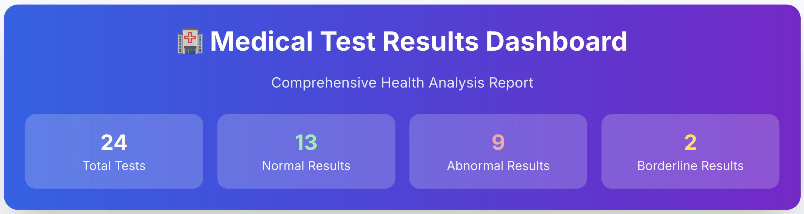

# Medical Record Translator

Translates medical documents (lab results, prescriptions) into plain English using AI.



## What It Does

- Upload PDF medical documents
- AI translates complex medical terms
- Shows results in an easy-to-read dashboard
- No data storage - files deleted after processing

## Tech Stack

**Frontend**: React + Vite + Tailwind CSS  
**Backend**: Python FastAPI + OpenAI GPT-4  
**File Processing**: PyMuPDF  

## Quick Start

### Prerequisites
- Node.js 18+
- Python 3.11+
- OpenAI API key

### Setup

1. **Clone repo**
```bash
git clone <repo-url>
cd medical-record-translator
```

2. **Backend setup**
```bash
cd backend
python -m venv venv
# Windows: venv\Scripts\activate
# Mac/Linux: source venv/bin/activate
pip install -r requirements.txt
cp .env.example .env
# Add your OpenAI API key to .env
```

3. **Frontend setup**
```bash
cd frontend
npm install
```

## Run the App

**Terminal 1 - Backend:**
```bash
cd backend
# Activate venv first
uvicorn app.main:app --reload --port 8000
```

**Terminal 2 - Frontend:**
```bash
cd frontend
npm run dev
```

Open http://localhost:5173

## How It Works

1. **Frontend** (React) - User uploads PDF
2. **Backend** (FastAPI) - Extracts text, sends to OpenAI
3. **OpenAI** - Translates medical terms
4. **Frontend** - Displays results in dashboard

## API Endpoints

- `POST /api/v1/translate/upload` - Upload PDF
- `GET /api/v1/translate/status/{job_id}` - Check progress
- `GET /api/v1/translate/result/{job_id}` - Get results

## Project Structure

```
frontend/
├── src/
│   ├── components/     # React components
│   ├── services/       # API client
│   └── App.jsx        # Main app
backend/
├── app/
│   ├── routers/       # API endpoints
│   ├── services/      # Business logic
│   └── main.py        # FastAPI app
```

## Deployment

See [QUICK_DEPLOYMENT_GUIDE.md](QUICK_DEPLOYMENT_GUIDE.md) for Railway/Render deployment.

## Security

- HTTPS only in production
- Files auto-deleted after 30 minutes
- No user data stored
- Rate limiting enabled

## License

MIT License

## Disclaimer

For educational purposes only. Not a replacement for medical advice.
